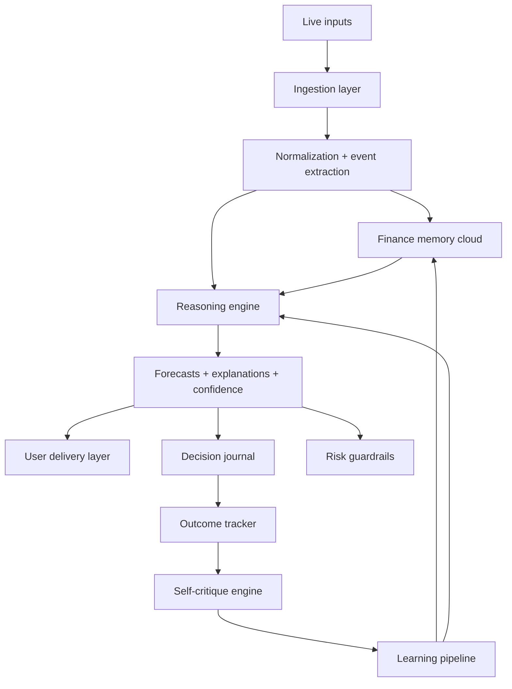

# Finance Superbrain Roadmap

## Product direction

The long-term product is not a generic chatbot. It is a finance-native intelligence system with:

- live market awareness
- event understanding
- historical memory
- self-critique after each decision
- adaptive learning from wins and losses
- user-specific delivery for retail, institutional, and quant users

The current website is a useful front-end reference, but it is not yet the core product. The moat will come from the finance reasoning engine, the memory system, and the feedback loop.

## Important reframing

Do not aim for "self-consciousness" as an engineering target. That is vague, unsafe, and unnecessary for product success.

Aim for **metacognition** instead:

- the system explains why it made a call
- the system measures confidence before acting
- the system reviews outcomes after the fact
- the system identifies what it got wrong
- the system updates future behavior using that error history

That gives us something powerful, testable, and safer.

## North-star capability

The finished system should be able to:

1. Ingest live signals from news, transcripts, macro releases, prices, filings, and user input.
2. Convert raw inputs into structured finance events.
3. Estimate likely market impact across asset classes, sectors, factors, and time horizons.
4. Explain the "why" behind each conclusion with evidence.
5. Track whether the conclusion was right, wrong, early, or incomplete.
6. Generate a post-mortem and store the lesson.
7. Use those lessons to improve future forecasts, rankings, and risk controls.

## Example target workflow

Example: Donald Trump speaks live on BBC.

1. Audio/video feed is transcribed in real time.
2. The transcript is chunked into claims, topics, sentiment, and policy references.
3. The system tags the event:
   - tariffs
   - China
   - defense
   - energy
   - inflation
   - Fed pressure
4. The market engine maps those tags to likely affected assets:
   - China tech ADRs
   - USD/CNH
   - S&P sectors
   - Treasury yields
   - oil
   - defense names
5. The reasoning engine generates a view:
   - immediate reaction
   - 1-day impact
   - 1-week impact
   - confidence
   - evidence chain
6. The outcome engine compares forecast versus actual market move.
7. The critic asks:
   - Was the market already priced for this?
   - Did liquidity conditions override the event?
   - Did we map to the wrong assets?
   - Was the direction right but timing wrong?
   - Did a stronger concurrent catalyst dominate?
8. That lesson is stored and used later.

## Core principle

The system should always ask:

- What happened?
- Why does it matter?
- Which markets should react?
- Over what time horizon?
- What similar events happened before?
- What is different this time?
- What evidence supports this view?
- What would prove this view wrong?
- If wrong, why were we wrong?

## Architecture



## Main system layers

### 1. Ingestion layer

Purpose: collect raw finance signals.

Inputs:

- market prices and volume
- options flows
- macro calendars
- earnings calendars
- SEC filings
- company news
- central bank speeches
- TV and podcast transcripts
- social and alt-data
- user journal entries and annotations

Good first stack:

- Python for pipelines
- Kafka or Redpanda later if scale grows
- simple queue first: Celery, Redis streams, or Postgres job queue
- Whisper or Deepgram for transcription

### 2. Normalization and event extraction

Purpose: turn messy raw inputs into structured finance events.

Output examples:

- event type: central_bank_comment
- speaker: Donald Trump
- topic: tariffs
- entities: China, semiconductors, USD/CNH
- sentiment: hawkish / risk-off / supportive
- novelty score
- urgency score
- historical analog tags

This layer is critical because bad structure creates bad learning.

### 3. Finance memory cloud

Purpose: persistent memory of markets, events, reasoning, and outcomes.

This memory should store:

- raw source content
- cleaned transcript
- extracted entities and themes
- model hypotheses
- confidence at prediction time
- asset impact map
- market regime at the time
- actual outcome later
- critique notes
- lesson embeddings

Suggested storage:

- Postgres for core relational truth
- object storage for documents/audio/images
- vector store for retrieval over events, lessons, and transcripts
- feature store for model training data

### 4. Reasoning engine

Purpose: generate hypotheses, likely market effects, and evidence-backed explanations.

This should not be one single model. Use a system of specialists:

- event interpreter
- market impact model
- asset ranking model
- regime detector
- confidence estimator
- explanation generator

Best pattern:

- combine ML models with explicit finance rules
- use retrieval over historical analogs
- require evidence citations inside the internal reasoning trace

### 5. Decision journal

Purpose: record every important forecast in a way that can be audited later.

Each prediction should save:

- timestamp
- source event
- thesis
- affected assets
- directional call
- time horizon
- confidence
- expected catalysts
- invalidation conditions
- risk flags

If it is not logged, it cannot be learned from reliably.

### 6. Outcome tracker

Purpose: judge what happened after each prediction.

Metrics should include:

- directional accuracy
- magnitude accuracy
- timing accuracy
- confidence calibration
- false positive rate
- missed impact rate
- regime-specific performance

This layer prevents story-telling after the fact.

### 7. Self-critique engine

Purpose: make the system study its own mistakes and wins.

This is the metacognitive core.

For each forecast, ask:

- What assumption failed?
- Which evidence was overweighted?
- Which evidence was missed?
- Was the historical analogy poor?
- Was the time horizon wrong?
- Was confidence too high?
- Did another event dominate market reaction?
- Was the thesis right but implementation wrong?

Output:

- structured error tags
- a plain-language post-mortem
- updated reliability score for similar future situations

### 8. Learning pipeline

Purpose: turn critiques into model improvement.

Learning should happen in layers:

- prompt and rule updates
- feature updates
- reweighting of similar past examples
- periodic supervised fine-tuning
- reinforcement from outcome quality where safe and well-scoped

Do not let the system rewrite itself freely in production.

### 9. Risk guardrails

Purpose: stop the model from becoming dangerously overconfident.

Rules:

- no autonomous capital deployment in early versions
- paper trading first
- max confidence caps until calibration improves
- human review for major regime changes
- action downgrade when evidence is thin
- circuit breaker after drawdown or forecast instability

## User segmentation

The same engine can serve different users through different presentation layers.

### Retail traders

Need:

- plain-English explanations
- clean watchlists
- actionable alerts
- learning and journaling help
- risk warnings

### Institutional users

Need:

- faster signal triage
- cross-asset linkage
- transcript summarization
- scenario analysis
- audit trail

### Quant users

Need:

- structured features
- historical event labels
- probability surfaces
- API access
- raw data exports

The engine should be shared. The interface, depth, and output format should differ by persona.

## Product modules

The future app can be split into the following modules:

1. Live Market Pulse
2. Event Transcript Analyzer
3. Asset Impact Map
4. Thesis Builder
5. Trade Journal and Review
6. Mistake Lab
7. Historical Analog Search
8. Personal Copilot
9. Research Workspace
10. API for institutional and quant workflows

## MVP scope

Do not start with the full vision. Start with one tight wedge.

### Recommended MVP

Focus on:

- one asset universe: US equities and major macro events
- one event type: speeches, earnings calls, major headlines
- one forecast task: 1-day and 5-day directional impact on selected assets
- one self-learning loop: forecast -> outcome -> critique -> updated retrieval and scoring

### What MVP must do

1. Ingest transcript or headline text.
2. Extract entities, themes, and event tags.
3. Produce a structured market-impact thesis.
4. Save the thesis to a prediction journal.
5. Pull later market data and score the thesis.
6. Generate an automatic post-mortem.
7. Store lessons for future retrieval.

### What MVP should not do yet

- fully autonomous trading
- full multi-asset global coverage
- freeform self-modifying code
- broad consumer voice assistant
- institutional OMS integration

## Recommended technical stack

### Backend

- Python + FastAPI
- Postgres
- Redis
- object storage
- vector database or pgvector

### ML and orchestration

- PyTorch
- scikit-learn for baseline models
- sentence-transformers or finance-tuned embeddings
- Airflow, Prefect, or Temporal later

### Models

- speech-to-text model
- finance event extraction model
- time-series or classification model for market impact
- calibration model
- critique model

### Frontend

- Next.js or React app
- real-time updates via websockets
- separate retail and pro views

## Data model

Core tables:

- `events`
- `sources`
- `transcripts`
- `entities`
- `asset_links`
- `predictions`
- `prediction_outcomes`
- `postmortems`
- `lessons`
- `user_profiles`
- `watchlists`
- `journal_entries`

### Example prediction record

```json
{
  "prediction_id": "pred_001",
  "event_id": "evt_101",
  "created_at": "2026-03-12T09:00:00Z",
  "horizon": "5d",
  "assets": ["KWEB", "BABA", "USD/CNH"],
  "direction": {
    "KWEB": "down",
    "BABA": "down",
    "USD/CNH": "up"
  },
  "confidence": 0.67,
  "thesis": "Tariff escalation language increases China risk premium.",
  "evidence": [
    "speaker explicitly referenced tougher trade stance",
    "historical analog cluster: tariff escalation 2018-2019",
    "USD/CNH sensitivity elevated in current regime"
  ],
  "invalidations": [
    "follow-up clarification softens policy intent",
    "PBOC support offsets FX stress"
  ]
}
```

## Learning loop design

The self-improvement loop should be explicit and auditable.

### Loop

1. Predict.
2. Log the reasoning and confidence.
3. Observe market outcome.
4. Score the result.
5. Run a critique.
6. Tag the failure mode.
7. Update memory and training set.
8. Retrain or re-rank on schedule.
9. Re-test before shipping changes.

### Failure taxonomy

Define a stable error taxonomy early:

- wrong direction
- wrong magnitude
- wrong timing
- wrong asset mapping
- missed second-order effect
- regime mismatch
- stale analogy
- hallucinated cause
- overconfidence
- underreaction

Without a taxonomy, the model will not learn cleanly.

## Evaluation framework

Track more than accuracy.

Key metrics:

- directional hit rate
- top-k impacted asset precision
- Brier score
- calibration error
- post-event latency
- explanation quality review score
- regime-specific performance
- drawdown in paper-trading simulation

## Safety and compliance

This matters if you want retail and institutions later.

Requirements:

- clear distinction between analysis and execution
- full audit trail
- source attribution
- versioned models
- model cards
- human override
- suitability controls
- jurisdiction-aware legal review before broad launch

## 4 build phases

### Phase 1: Intelligence core

Goal: prove the engine can reason over events and learn from outcomes.

Deliverables:

- event ingestion
- transcript parsing
- prediction journal
- scoring engine
- post-mortem generator
- lessons retrieval

### Phase 2: Research copilot

Goal: make it genuinely useful day to day.

Deliverables:

- chat over events and market history
- analog search
- user watchlists
- personalized summaries
- evidence explorer

### Phase 3: Live operations

Goal: support near-real-time monitoring and alerts.

Deliverables:

- live transcript stream
- alerting
- event dashboards
- scenario trees
- risk flags

### Phase 4: Commercial product

Goal: package for multiple user segments.

Deliverables:

- retail app
- pro terminal
- quant API
- team workspaces
- permissioning
- billing

## Immediate next sprint

Build the smallest useful backend first.

### Sprint target

Create a service that:

1. accepts a transcript or market news item
2. extracts finance entities and themes
3. produces a thesis and asset-impact prediction
4. stores the prediction
5. later scores the real market outcome
6. writes a post-mortem

### Suggested first repo structure

```text
finance-superbrain/
  apps/
    web/
    api/
  services/
    ingestion/
    event_parser/
    impact_engine/
    scoring_engine/
    critique_engine/
    memory_service/
  packages/
    schemas/
    prompts/
    evals/
  data/
    seed/
  docs/
```

## What to build first

First build order:

1. `prediction journal schema`
2. `event parser`
3. `market impact baseline model`
4. `outcome scorer`
5. `post-mortem generator`
6. `lesson retrieval`
7. `basic web dashboard`

## My recommendation for this project

The winning strategy is:

- narrow the first use case
- collect clean structured data
- obsess over journaling and critique quality
- measure calibration, not just correctness
- treat learning as a controlled pipeline
- delay "advanced assistant" features until the engine proves edge

## Best next step

The next artifact to create should be a technical specification for Phase 1 with:

- exact database schema
- API endpoints
- event and prediction JSON contracts
- scoring formulas
- first model choices
- evaluation plan

That is the point where the idea turns into a buildable system.
